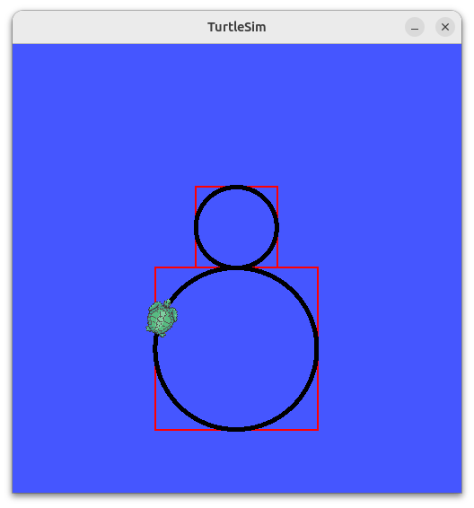

# Figure 8 Turtlesim
## Objectives
- Get familiar with ROS concepts, such as [node](https://docs.ros.org/en/jazzy/Tutorials/Beginner-CLI-Tools/Understanding-ROS2-Nodes/Understanding-ROS2-Nodes.html) and 
[topic](https://docs.ros.org/en/jazzy/Tutorials/Beginner-CLI-Tools/Understanding-ROS2-Topics/Understanding-ROS2-Topics.html).
- Manage a ROS [package](https://docs.ros.org/en/jazzy/Tutorials/Beginner-Client-Libraries/Creating-Your-First-ROS2-Package.html) with an [executable](https://docs.ros.org/en/jazzy/Tutorials/Beginner-Client-Libraries/Writing-A-Simple-Py-Publisher-And-Subscriber.html).
- Practice node execution with topic [publisher and subscriber](https://docs.ros.org/en/jazzy/Tutorials/Beginner-Client-Libraries/Writing-A-Simple-Py-Publisher-And-Subscriber.html).

## Requirements: 
1. [Create a ROS workspace](https://docs.ros.org/en/jazzy/Tutorials/Beginner-Client-Libraries/Creating-A-Workspace/Creating-A-Workspace.html#create-a-new-directory). 
Clone this repository down to the right location in your ROS workspace.
2. Complete the [figure8_node.py](turtlesim_play_pkg/turtlesim_play_pkg/figure8_node.py).
   Fill approriate expressions to the `None` values in the commented sections:
   ```python
   ### START CODING HERE ###

   ### END CODING HERE ###
   ```
   - The turtle is expected to drive a figure 8 pattern.
   - The turtle is supposed to draw the top circle couterclockwisely with a **radius of 1**.
   - The turtle is supposed to draw the bottom circle clockwisely with a **radius of 2**.
   - The **angular velocity** of the turtle will be fixed to **$$\frac{\pi}{4}$$**.
   
   You need to determine the **linear velocity** and `/turtle1/cmd_vel` topic **publish rate** to limit the turtle's movement in the red rectangular boundaries.
   An expected turtle trajectory figure is shown below.
   
   
3. Build your package and verify your node's functionality.
   1. To build your package, open a terminal and run following commands:
   ```console
   cd <ros workspace path>
   colcon build
   source install/local_setup.bash  # CRITICAL, or ROS can't find your package
   ```   
   2. Start `turtlesim_node` in a terminal
   ```console
   ros2 run turtlesim turtlesim_node
   ```
   3. Open another terminal, start the `figure8_node`
   ```console
   ros2 run turtlesim_play_pkg figure8_node
   ```
5. Let the turtle complete at least five laps then upload your figure 8 to the [images/](turtlesim_play_pkg/images/) directory.
6. (5%) Fill the `<description>`, `<maintainer>`, `<maintainer_email>` fields with your own information in [package.xml](turtlesim_play_pkg/package.xml) and [setup.py](turtlesim_play_pkg/setup.py).

## Study Resources
Given an object is doing the circular motion in constant linear/angular velocity. 
The relationship between the linear and angular velocity is shown as the following figure, where $$r$$ is the radius of the circle.


## Troubleshooting:
- Make sure your environment is correctly setup by following this [tutorial](https://docs.ros.org/en/humble/Tutorials/Beginner-CLI-Tools/Configuring-ROS2-Environment.html)
- Make sure you have sourced your workspace's configuration before `ros2 run ...`
```console
source <ros workspace location>/install/local_setup.bash
```
- Make sure you have edited `setup.py` and include the Python file in **'console_scripts'**.
