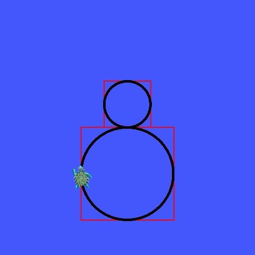

# Figure 8 Turtlesim
## Objectives
- Get familiar with ROS concepts, such as [node](https://docs.ros.org/en/jazzy/Tutorials/Beginner-CLI-Tools/Understanding-ROS2-Nodes/Understanding-ROS2-Nodes.html) and 
[topic](https://docs.ros.org/en/jazzy/Tutorials/Beginner-CLI-Tools/Understanding-ROS2-Topics/Understanding-ROS2-Topics.html).
- Manage a ROS [package](https://docs.ros.org/en/jazzy/Tutorials/Beginner-Client-Libraries/Creating-Your-First-ROS2-Package.html) with an [executable](https://docs.ros.org/en/jazzy/Tutorials/Beginner-Client-Libraries/Writing-A-Simple-Py-Publisher-And-Subscriber.html).
- Practice node execution with topic [publisher and subscriber](https://docs.ros.org/en/jazzy/Tutorials/Beginner-Client-Libraries/Writing-A-Simple-Py-Publisher-And-Subscriber.html).

## Requirements: 
1. (5%) Download and build the ROS package. 
   1. [Create a ROS workspace](https://docs.ros.org/en/jazzy/Tutorials/Beginner-Client-Libraries/Creating-A-Workspace/Creating-A-Workspace.html#create-a-new-directory).
   2. Clone this repository down to the `/src` dirctory in your ROS workspace.
   3. Build `turtlesim_play_pkg` package.
      **NOTE**: you need to specify `<ros workspace path>` according to the 1st step.
      Verify if your package was downloaded to the right location and was successfully built.
      1. Open a terminal window and run following commands:
      ```console
      cd <ros workspace path>
      colcon build
      source install/local_setup.bash  # CRITICAL, or ROS can't find your package
      ```   
      2. Start `turtlesim_node` in a terminal
      ```console
      source <ros workspace path>/install/local_setup.bash
      ros2 run turtlesim turtlesim_node
      ```
      3. Open another terminal, start the `figure8_node`
      ```console
      source <ros workspace path>/install/local_setup.bash
      ros2 run turtlesim_play_pkg figure8_node
      ```
   In case of mistakes, you'll want to start over. Remove the entire ROS workspace using command: `rm -rf <ros workspace path>`
2. (80%) Complete the [figure8_node.py](turtlesim_play_pkg/turtlesim_play_pkg/figure8_node.py).
   Fill approriate operations between the commented lines:
   ```python
   ### START CODING HERE ###

   ### END CODING HERE ###
   ```
   - (20%) The turtle is expected to leave **identical** figure 8 trjectories from lap to lap.
   - (20%) The turtle's trajectory (figure 8) needs to be **inscribed** within the two squares (See image below for an example).
   - (20%) The turtle is supposed to draw the top circle couterclockwisely with a **radius of 1**.
   - (20%) The turtle is supposed to draw the bottom circle clockwisely with a **radius of 2**.
   - The **angular speed** of the turtle has to be fixed at **$$\frac{\pi}{4}$$ rad/s**.
   
   You need to determine the **linear velocity** and `/turtle1/cmd_vel` topic **publish rate** to regulate the turtle's motion.
   
   

3. (10%) Let the turtle complete at least five laps then upload your figure 8 to the [images/](turtlesim_play_pkg/images/) directory.
   Illustrate Your turtle's execution below (edit next line in this [README](README.md)):
   
   
   
5. (5%) Fill the `<description>`, `<maintainer>`, `<maintainer_email>` fields with your own information in [package.xml](turtlesim_play_pkg/package.xml) and [setup.py](turtlesim_play_pkg/setup.py).
Look for the fields marked with `TODO` in these files.

## Study Resources

### Circular Motion Kinematics
Given an object is doing the circular motion in constant linear/angular velocity. 
The relationship between the linear and angular velocity is shown as the following figure, where $$r$$ is the radius of the circle.


### Linux Command Line Tutorial
[https://ubuntu.com/tutorials/command-line-for-beginners#1-overview](https://ubuntu.com/tutorials/command-line-for-beginners#1-overview)

## AI Policies
Please acknowledge AI's contributions according to the policies in the [syllabus](https://linzhanguca.github.io/_docs/robotics2-2025/syllabus.pdf).
